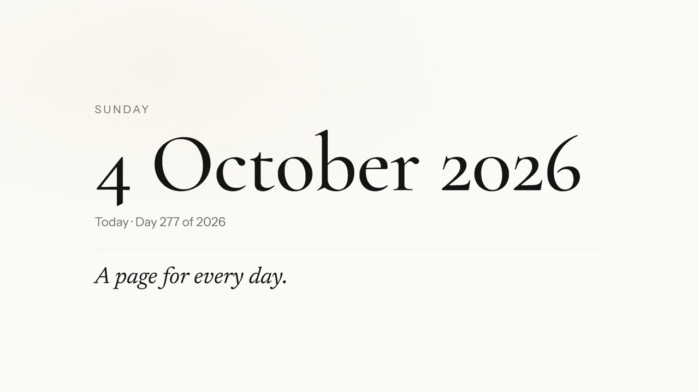

# Daybook

A private journal: a page for every day, on the web and as an Android app.

- **Website:** https://geosubash-glitch.github.io/daybook/
- **Android app:** https://geosubash-glitch.github.io/daybook/download.html (signed APK). Play Store steps are in `PUBLISHING.md`.

| Folder | What it holds |
|---|---|
| `docs/` | The whole app (website, and what is packed into the Android app). No build step |
| `docs/store-firebase.js` | The only file that talks to Firebase |
| `firestore.rules` | Who may read and write what in the database |
| `android-res/`, `signing/` | App icons, test signing key, Firebase Android config |
| `.github/workflows/` | `android.yml` builds the test APK. `release.yml` builds the Play bundle |
| `store/` | Play Store artwork and listing text |
| `SETUP.md` | How the backend was set up |
| `PUBLISHING.md` | How to publish on Google Play |
